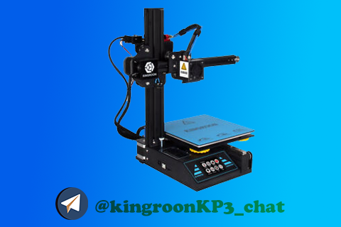

# Прошивка Marlin для принтера KingRoon KP3

Данный fork создан на основе последнего marlin 2.x bugfix, дополняется и периодически обновляется из официального репозитория Marlin.

## Назначение сборки:

  -	Принтер KingRoon KP3 с датчиком автоуровня BLTouch
  -	Информация по замене стоковой платы на MKS Robin nano v. 2.0: https://3dtoday.ru/blogs/malderin/kingroon-kp3-menyaem-platu-na-mks-robin-nano-v20-s-draiverami-tms-2209
  -	В прошивку забиты параметры, взятые с моего экземпляра принтера (например, PID экструдера и стола, отступы по X и Z под датчик автоуровня и т.п.)

## Особенности сборки (обновляемый и дополняемый раздел):

  1.  Используется графический интерфейс от производителя платы Makerbase;
  2.	Изменено лого при загрузке на лого данного принтера;
  3.	Добавлен пункт «Уровень» для возможности ручной регулировки стола по 4 угловым и 1 центральной точке. Данный пункт при использовании датчика авто уровня обычно по умолчанию скрывается и заменяется иконкой «авто», что не удобно;
  4.	Обновлен и подкорректирован русский перевод (где-то подправлены смещения, на кнопках во время печати, например, где-то допереведены пункты меню);
  5. Объединил пункты "экструзия" и "замена" в одно меню, убрал из меню "инструменты" меню "замена"
  6. Добавил меню "больше" с пересетми по нагреву. Настройка из файла Configuration_adv.h, параметр  #define CUSTOM_USER_MENUS
  7. В прошивке активировано включение вентилятора хотэнда при достижении его температуры 100 градусов. Для реализации данной функции необходимо подключить вентилятор хотэнда в разъем для второго нагревателя. Спасибо за подсказку https://github.com/X-Dron.

## После прошивки необходимо выполнить:

  - Сброс EEPROM (настройки/EEPROM/Восстановить заводские настройки по умолчанию;
  - Сохранение настроек EEPROM (там же в меню)

## Известные проблемы:
  1. Не работает датчик окончания филамента (отключите его для использования прошивки)
  2. Не работает модуль файфай, МКС вроде как обещают сделать когда нибудь...
  3. Не работают миниатюры моделей на карте памяти (то же проблема от МКС)

Связь со мной через телеграмм: https://t.me/kingroonkp3_chat
